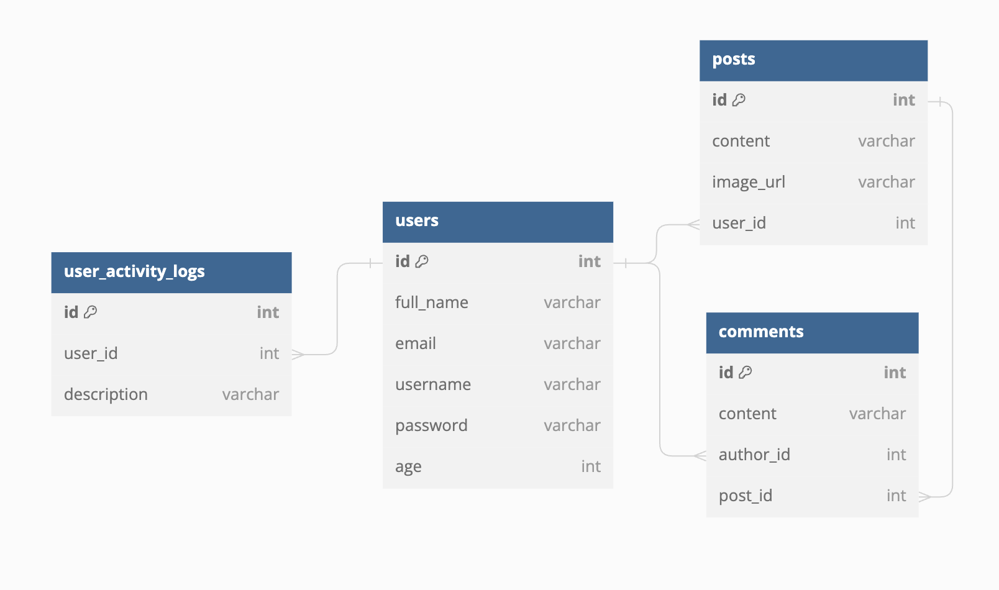

# LinkedOut

## Description

Photo based social media back-end API with Go.

## Tech Stacks

- Go 
- Gorm
- Echo 
- REST
- JWT Auth
- PostgreSQL
- Swagger
- 3rd Party API

## Entity Relationship Diagram



## Application Flow
- Application can be accessed on http://localhost:8080
- Application endpoints:
  - <b>POST</b> /users/register
    - request body -> `{ first_name, last_name, address, email, username, password, age }`
  - <b>POST</b> /users/login 
    - request body -> `{ username, password }`
  - <b>POST</b> /posts
    - request headers -> `{ authorization }`
    - request body -> `{ content, image_url }`
  - <b>GET</b> /posts
    - request headers -> `{ authorization }`
  - <b>GET</b> /posts/:id
    - request headers -> `{ authorization }`
  - <b>DELETE</b> /posts/:id
    - request headers -> `{ authorization }`
  - <b>POST</b> /comments
    - request headers -> `{ authorization }`
    - request body -> `{ content, post_id }`
  - <b>GET</b> /comments/:id
    - request headers -> `{ authorization }`
  - <b>DELETE</b> /comments/:id
    - request headers -> `{ authorization }`
  - <b>GET</b> /activities
    - request headers -> `{ authorization }`

## How to Use

1. Make an `.env` based on the `.env.example`

2. On the root folder of this repository, run the following command:

```bash
go run main.go
```

3. Access the documentation through http://localhost:8080/swagger/index.html